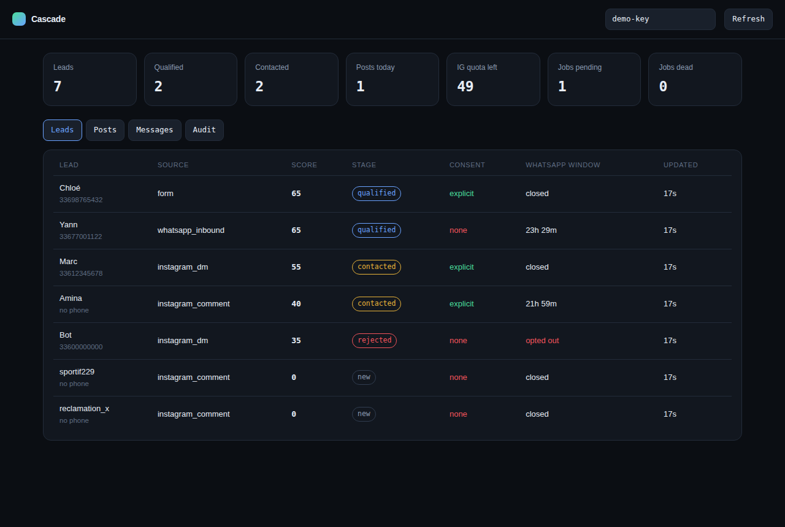
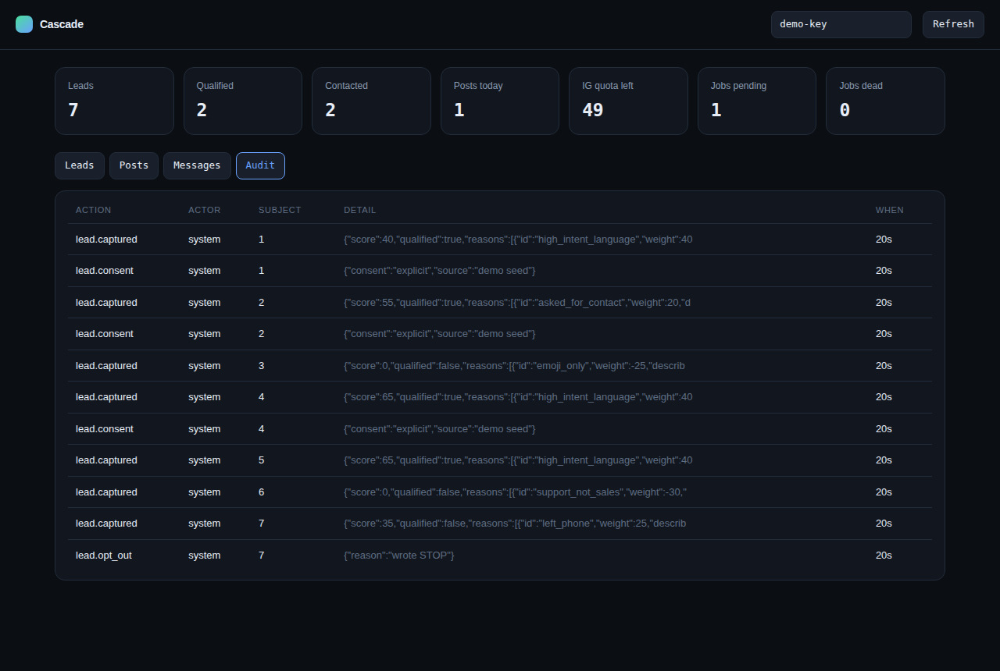

# Cascade

An Instagram to WhatsApp pipeline that a business can actually run: publish content, capture
the people who react to it, qualify them, and hand the good ones to WhatsApp **only when
there is consent to message them**.

It is built on the official APIs (Instagram Graph API, WhatsApp Cloud API) and orchestrated
with n8n. There is no scraping, no automation of a personal account, and no bulk DMing of
strangers, because all three get the account restricted and the number banned, usually right
after the campaign starts working.



## What it does

```
content brief ──► caption draft ──► HUMAN APPROVES ──► Instagram publish
                                                            │
                                      comments and DMs ◄────┘
                                            │
                                   capture + dedupe + score
                                            │
                              qualified? ──► private reply asking for consent
                                            │
                                   consent given ──► WhatsApp
                                            │
                              24h window open? ─ yes ─► free-form reply
                                            └─ no ──► approved template
```

Each arrow is a thing that goes wrong in production, and the code has an opinion about each:

| Step | The trap | What Cascade does |
|---|---|---|
| Publishing | A reel container is still transcoding when you publish it | Polls `status_code` until `FINISHED`, then publishes |
| Publishing | A retry posts the same content twice | Every post carries an idempotency key; a retry resumes |
| Publishing | Hitting the 50 posts / 24h cap mid-campaign | Quota checked before the API call, not discovered as error 80007 |
| Capture | Meta redelivers the same webhook for hours | Every event is claimed once by its provider id |
| Capture | Two comments from one person become two leads | Deduplicated by phone, then by Instagram handle, keeping the best score |
| Outreach | Free-form message outside the 24h window is rejected (131047) | The window is evaluated before sending, and a template is used instead |
| Outreach | Messaging people who never opted in destroys the number's quality rating | Consent is a column, checked on every send, with its source recorded |
| Outreach | Somebody writes STOP and gets messaged again | Opt-out is detected in French and English, honoured immediately, confirmed once |

## Run it

```bash
npm install
npm test          # 64 tests, no credentials and no network needed
npm run demo      # console on http://localhost:8080 with a seeded day of activity
```

For the real thing, copy `.env.example` to `.env`, fill in the Meta credentials
([docs/SETUP.md](docs/SETUP.md) walks through where each one comes from), then:

```bash
npm start
```

Point the Meta webhooks at `https://your-host/webhooks/instagram` and
`https://your-host/webhooks/whatsapp`, and import the three files in `workflows/` into n8n.

## How the pieces split

**n8n owns the parts that change weekly**: which content source, which model writes the
caption, who approves it, where the daily report goes. Those are the client's decisions and
they should be editable in a browser without a deployment.

**This service owns the parts that must not change by accident**: the publishing state
machine, the consent gate, the 24 hour window, deduplication, retries and the audit trail.
They live in tested code because a mistake there costs an Instagram account or a WhatsApp
number, not an afternoon.

The seam between them is a small HTTP API (`/api/posts`, `/api/leads`,
`/api/leads/:id/outreach`, `/api/stats`) authenticated with a shared key.

## The console

A single page: pipeline counters, lead list with score, stage, consent and **time left in the
WhatsApp window**, the post queue, the message log, and the audit trail. It is read-only by
design: anything that sends is an API call with a record behind it.



## Tests

```bash
npm test
```

64 tests covering what actually breaks:

- the 24 hour window at its boundary, one second either side
- webhook signatures: tampered body, wrong secret, missing header, and the re-serialisation
  mistake that makes people disable verification altogether
- Meta's error codes: retry on 4 / 80007 / 429, never retry on 190 or 100, and an HTTP 200
  carrying an error body is still an error
- reel publishing that waits for transcoding, carousels that build one child container per
  item, and an idempotent re-publish that does not post twice
- opt-out detection in French and English, and an opted-out contact that no permission can
  override
- a queue that retries with backoff and dead-letters what will never succeed

## Scope and honesty

Cascade automates outreach **to people who asked for it**. It deliberately does not:

- scrape followers, hashtags or competitor audiences
- automate a personal Instagram account through an unofficial client
- send bulk WhatsApp messages to purchased or harvested lists

Those are the fastest ways to lose the assets the business is built on. See
[docs/COMPLIANCE.md](docs/COMPLIANCE.md) for the rules this follows and what the platforms do
when you do not.

## Licence

MIT.
